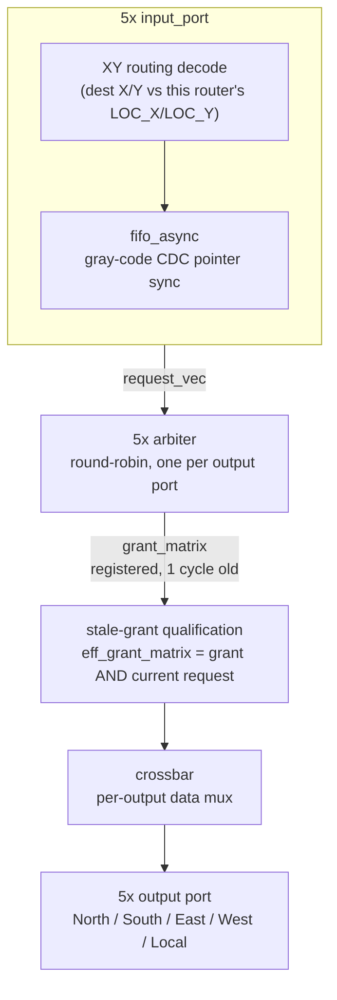
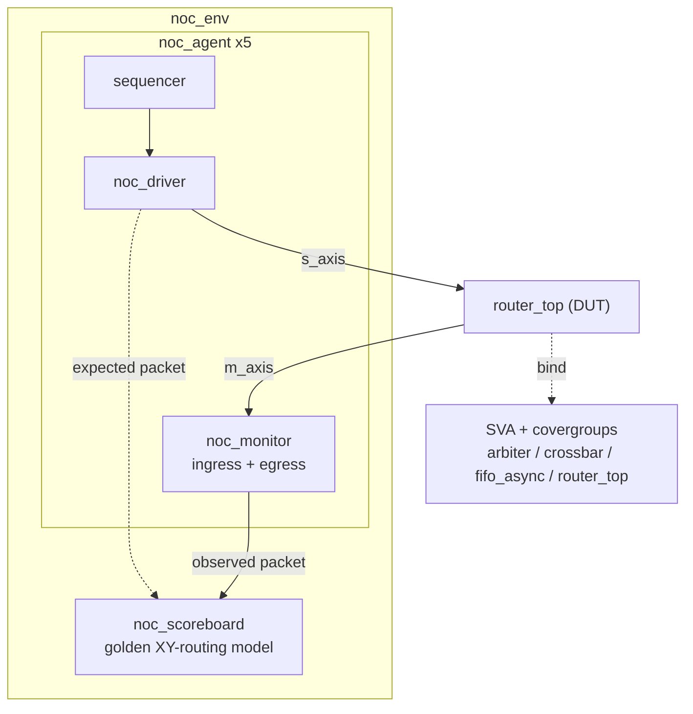

# NoC Router with UVM Verification Environment

I built this to get real hands-on practice with UVM and SystemVerilog assertions, not just write toy RTL and call it done. It's a 5-port packet-switched Network-on-Chip (NoC) router, verified with a full UVM testbench, SVA, and functional coverage. Built and simulated with [Verilator](https://verilator.org/).

What I'm proudest of: I caught a real stale-grant race bug purely from waveform traces, tracked down the root cause, fixed it, and then wrote an SVA property (`a_no_stale_grant`) specifically so it can never quietly come back. More on that below.

## Overview

The router (`router_top`) connects 5 ports — North, South, East, West, and Local — using dimension-order (XY) routing. Each input port buffers incoming traffic through an asynchronous FIFO, a round-robin arbiter resolves output contention when multiple inputs target the same output in the same cycle, and a crossbar switches the winning data through.

## Architecture

```
5x input_port
  |-- XY routing decode (dest X/Y vs this router's LOC_X/LOC_Y)
  `-- fifo_async (gray-code CDC pointer sync)
        |
        | request_vec
        v
5x arbiter (round-robin, one per output port)
        |
        | grant_matrix (registered -- one cycle stale)
        v
stale-grant qualification
eff_grant_matrix = grant_matrix AND current request_vec
        |
        v
crossbar (per-output data mux)
        |
        v
5x output port (North / South / East / West / Local)
```

<details>
<summary>Prettier version (renders on GitHub)</summary>



</details>

**Routing.** Each `input_port` compares a packet's destination X/Y against the router's own coordinates and produces a one-hot request toward the correct output (X mismatch routes East/West, Y mismatch routes North/South, exact match routes Local).

**Arbitration.** Each output has its own `arbiter` instance. My first pass used a fixed priority chain, and it did exactly what you'd expect: starved the higher-numbered ports under sustained contention. The fix was to rotate the request vector so the current priority pointer always lands on bit 0, grant lowest-index-wins on the rotated vector, then rotate the result back — that gives genuine round-robin fairness instead of a popularity contest. The pointer only advances on a cycle where something actually won.

**The stale-grant fix.** This was the bug I'm most pleased with catching. `grant_matrix` is a registered decision — it reflects what an input requested *last* cycle. If that input's FIFO head has since advanced to a different packet (say it won a different output this same cycle and popped), the old grant is now stale, and using it directly would route the wrong packet entirely. I found this by watching waveforms and noticing a grant firing for a packet that had already moved on. `eff_grant_matrix` re-qualifies every grant against the winner's *current* request before it's allowed to drive the crossbar or assert `tvalid`. It's now regression-guarded by the `a_no_stale_grant` SVA property in `dv/sva/router_top_sva.sv`, so if this ever creeps back in, the assertion catches it immediately instead of requiring another waveform hunt.

**Buffering / CDC.** `fifo_async` is a genuine dual-clock FIFO — gray-coded read/write pointers with a 2-flop synchronizer chain across the clock boundary, independently clock- and reset-verified in `dv/fifo_async_tb.cpp` and checked by `dv/sva/fifo_async_sva.sv` (including a hamming-distance-1 property on each pointer's transitions). In the current top-level integration, each port's FIFO write and read clocks are tied to the same system clock; the CDC-safe primitive is there and independently proven, but the top-level isn't currently driving genuinely asynchronous port clocks. That's on my list, not a limitation I'm pretending doesn't exist.

## Verification Environment

```
noc_env
  |-- noc_agent x5
  |     sequencer -> driver (noc_driver)
  |     monitor (noc_monitor): ingress + egress
  `-- scoreboard (noc_scoreboard) -- golden XY-routing model

driver --s_axis--> router_top (DUT) --m_axis--> monitor
driver ..expected packet..> scoreboard <..observed packet.. monitor
router_top ..bind..> SVA + covergroups (arbiter / crossbar / fifo_async / router_top)
```

<details>
<summary>Prettier version (renders on GitHub)</summary>



</details>

**Test plan (`noc_test.sv`).** Seven phases: baseline random traffic on all ports, a directed 4-way collision on the Local output, a boundary-address case, then four coverage-closure phases I added after actually running coverage and finding specific gaps — a targeted round-robin branch that random traffic never hit, a full 5-way collision, a deterministic dest-coordinate sweep, and stepped 2-through-5-way contention on the North output. I didn't get all of this right on the first try; the closure phases exist because the first pass at coverage wasn't as complete as I assumed.

**Scoreboard.** Predicts each packet's expected output port from its destination coordinates, then matches against actual egress. It searches each source port's entire pending queue (not just the head), which lets it distinguish three outcomes instead of a flat pass/fail: matched-in-order, matched-but-reordered, and genuinely missing (dropped/corrupted/misrouted). That distinction mattered — early on I'd have written off reordering as a failure when it's actually expected behavior under contention.

**SVA.** One bind-in checker module per RTL block:
- `arbiter_sva.sv` — grant one-hot, no phantom grants, round-robin pointer only advances on an actual win
- `crossbar_sva.sv` — mux output matches the selected input, illegal select defaults to zero
- `fifo_async_sva.sv` — no write-when-full / read-when-empty, gray pointers move by exactly one bit per change, FIFO can't come out of reset already full or non-empty
- `router_top_sva.sv` — the stale-grant regression guard described above, plus general grant/crossbar legality

**Functional coverage.** Covergroups for destination coordinates, source→output pairing, and per-output contention level (`dv/sva/*_coverage.sv`), plus a hand-rolled counter-based fallback (`*_handcov.sv`) that cross-checks the same bins independently, since I didn't fully trust Verilator's covergroup support to be the only signal telling me I was done.

## Repository Structure

```
rtl/
  router_top.sv               top-level integration
  input_port.sv                XY decode + fifo_async instance
  arbiter.sv                   round-robin arbiter
  crossbar.sv                  output mux
  fifo_async.sv                dual-clock async FIFO
  axi_stream_fifo_wrapper.sv   AXI-Stream handshake wrapper around fifo_async

dv/
  noc_pkg.sv, noc_test.sv, noc_env.sv, noc_agent.sv,
  noc_driver.sv, noc_monitor.sv, noc_scoreboard.sv,
  noc_packet.sv, noc_seq.sv, noc_if.sv, tb_top.sv, tb_main.cpp
  sva/                         SVA + functional coverage, bound into each RTL module
  *_tb.cpp                     standalone Verilator smoke tests (arbiter, crossbar, fifo_async, router_top)

uvm-src/                       vendored UVM (gitignored, see Build below)
Makefile
```

## Build & Run

Requires [Verilator](https://verilator.org/) 5.x.

```bash
# uvm-src isn't committed - fetch it first
git clone --branch uvm-2017-1.0-vlt --depth 1 \
  https://github.com/chipsalliance/uvm-verilator.git uvm-src

make compile
make run
```

`make run` builds the full UVM environment against `router_top` and prints a scoreboard summary plus a UVM report summary on completion.
